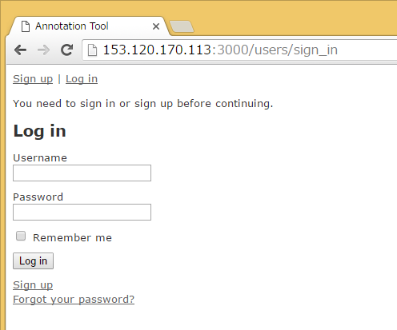
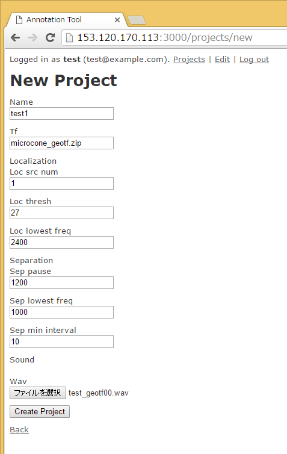

:imagesdir: 
:backend: html5
:doctype: book
:idprefix: id
:toc: left
:toc-title: 目次

= Web Annotation Tool の使い方

== 概要

本ソフトウェアは、マイクロフォンアレイを用いて収録された音ファイルを解析し、空間的・時間的に存在する音イベントに対して、ユーザがWebベースで直観的にアノテーションを行うことを可能にする。

== 機能

* ユーザ管理・アノテーションプロジェクト管理　（本ソフトウェアでは、一つの音ファイルに対応するパラメータやアノテーションデータをまとめて「プロジェクト」という単位で管理する）

* マイクロフォンアレイを用いて収録されたwavファイルをアップロードし、HARK を用いてサーバ側で音源定位・音源分離を行う

* 音源定位・分離におけるパラメータの設定

* アノテーションにおける以下の操作
** 音源定位・分離した音イベントの可視化
** アップロードした音ファイルの再生・スペクトログラム表示
** 音源定位（MUSIC法）で用いたMUSICスペクトログラムの表示
** 分離音の再生・スペクトログラム表示

== アノテーションまでの手順
アノテーション作業をする前に以下のことを行う必要がある。

. ユーザ登録をする
. ログインし、プロジェクトを登録する
. ラベルを設定する

### ユーザ登録
まず、未ログインの状態で、
http://153.120.170.113:3000/
にアクセスすると下のようなログイン画面が開く。

初めて使う場合は、ユーザ登録を行う必要がある。ユーザ登録を行うには「sign up」のリンクをクリックする。すると、以下のような画面が開く。

必要項目を入力したら、「sign up」ボタンを押す。

新しく登録すると、自動的にそのユーザでログインされた状態になる。

=== プロジェクト作成

ログインが完了すると、以下のような画面になる。下図の画面はプロジェクト管理画面ですが、新たなユーザでは、まだ何もプロジェクトが作成されていないため、このようなシンプルな画面になっています。

次に、新たなプロジェクトを作成するためには、「New Project」
リンクをクリックする。すると、以下のような画面が開くので、必要な項目を変更する。
この時、「ファイルを選択」
の部分からマイクロフォンアレイで収録したローカルの.wavファイルをアップロードすることができる。

必要事項を入力後、「Create Project」ボタンを押して、プロジェクトを作成する。

[quote]
____
伝達関数ファイルは現在
microcone_geotf.zip　と
microcone_rectf.zip　にのみ対応
____

プロジェクトの作成が完了すると、以下のような画面が開く。ここで、アップロードした音ファイルの確認等ができる。問題なければ、「back」のリンクをクリックすると、プロジェクト管理画面に戻ることができる。

プロジェクト管理画面に戻ると、以下のような画面になる。

ここで「Status」の項目が「Pending」となっている場合、サーバでアップロードした音ファイルの解析処理を行っているため、処理が終わるまで待つ必要がある。解析が終わると、自動的に以下のようになる。

=== ラベル

プロジェクトの作成を完了した後、そのプロジェクトにアノテーションをするために
ラベルデータを作成する必要がある。

プロジェクト管理画面の「Annotation」リンクをクリックすると、まだアノテーションすべきラベル
が用意されていないので以下のような画面になる。また、プロジェクト管理画面から「Label」のリンクをクリックしても以下の画面に移動することができる。

右の「All labels」が全ラベルの一覧で、左の「Registered labels」がプロジェクトに登録されたファイルである。

この画面では、「All labels」からプロジェクトに必要なラベルを選択し、「<- Add」ボタンをおすことで、プロジェクトに必要なラベルを追加することができる。

上図の状態で「<- add」ボタンを押すと以下のようになることが確認できる。

逆に、一度登録したものを削除したい場合は、以下のように、
左の「Registered labels」から削除したいものを選択し、「-> Delete」ボタンを押します。

上図の状態で「-> Delete」ボタンを押すと以下のようになることが確認できる。

### 新規ラベル作成

新たにラベルを作成するにはラベル編集画面から、「New Label」をクリックすると、以下のようなラベル新規作成画面が新たなタブとして開くので、必要な情報を入力し、「Create labels」ボタンをクリックする。

ラベルの作成が成功すると以下のような表示になる。

ラベルの新規作成後、ラベル登録画面を開いたままの場合、ブラウザの更新を行う必要がある。

元のタブに戻り、更新を行うと以下のように新たにラベルが追加されていることがわかる。

ラベル登録後は、「back」のリンクをクリックすることで、プロジェクト管理画面に戻ることができる。

== アノテーション
ラベル登録後、プロジェクト管理画面から、「Annotation」をクリックすると、以下のようなアノテーション画面になる。

### 画面説明

. stop : 再生中の音を停止する。
. play : 音を最初から再生する。
. resume :　音を停止した場所から再生する。
. clear label :　ラベルをすべて削除する。
. save label :ラベルファイル(.csv)をダウンロードする。
. このプロジェクトに登録されているラベル：
アノテーションするラベルを選択する。＊の色が、アノテーション画面のラベルの色と対応している。
. アノテーション画面：
縦軸：角度、横軸時間のタイムラインを表示している。
. 音イベント：各音イベントはこのように表示される。ここをクリックすることでアノテーションを行う。
. 音ファイル確認画面：元の音ファイルのスペクトログラムと現在の再生位置の表示をする。
. 分離音：選択した音イベントの詳細、分離音の再生、スペクトログラム表示を行う。

[quote]
____
その他のボタンはテスト用です。一部は消えるかもしれません
____

=== ラベルロード
ローカルに保存されたラベルファイル(.csv)をロードする場合は以下の手順
. 「clear label」ボタンを押し、現在編集中のラベルをすべてクリアする。
. ダウンロードしたラベルを画面にドラッグアンドドロップする。

[quote]
____
いちいちクリアしなくてもいいようにするかもしれません。また、サーバ側にラベルは現在保存されないので、ブラウザを閉じたり、更新したりすると、アノテーション情報が消えるので注意してください
____

=== ラベルファイル
以下のフォーマットのcsv

ラベルファイル形式
----------------
音イベントID,ラベル,時刻,方向,分離音ID,アノテーション済みフラグ（注：自動アノテーション時に使う）
----------------

注意事項

. 各行はソートされていない
. 時刻の単位は「秒」
. 方向は0-1で正規化「０＝１８０度、１＝－１８０度」
. 分離音IDは分離音のファイル名sep_?.wavと一致

=== マウス操作
以下の操作はアノテーション画面内でのみ可能。

* 左クリック：音イベントの選択（これにより選択した音イベントの詳細が⑩に表示される）
* 右クリック：現在選択されているラベルをアノテーションする。
* 中クリック：アノテーション済みかどうかのフラグを立てる。
（注：自動アノテーション時に使う）
* CTRLキー＋中クリック（ドラッグ＆ドロップ）：範囲内のラベルの一括アノテーション（注：テスト機能）

以下の操作は音イベントの定位情報（時空間的情報）を編集するので注意。

* CTRLキー＋左クリック（ドラッグ＆ドロップ）：新たな音イベントの作成
* CTRLキー＋右クリック：音イベントの削除

== 未実装機能

=== プロジェクト管理
* アノテーション情報のサーバ側への保存
* ユーザ間でのプロジェクトの共有
* プロジェクト間での音ファイル共有
* 伝達関数ファイルアップロード
* 分離音の一括DL

=== アノテーション画面

* undo/redo
* ラベルファイルの構造化

